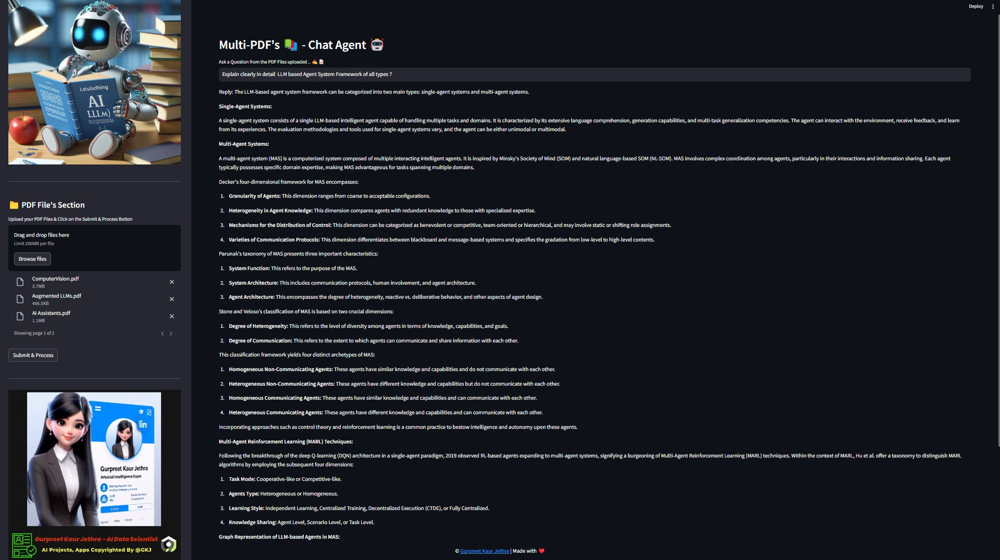

# Multi-PDF-s 📚 ChatApp AI Agent 🤖

**Meet Multi-PDF Chat AI App!** 🚀  
Chat seamlessly with multiple PDFs using **LangChain**, **Google Gemini Pro**, and **FAISS Vector DB**, deployed effortlessly with **Streamlit**. Get **instant, accurate responses** powered by the robust Google Gemini open-source language model. 📚💬  
**Transform your PDF experience today!** 🔥✨  

---

## 📝 Description

The **Multi-PDF's Chat Agent** is a Streamlit-based web application designed for interactive conversations with a chatbot. Upload multiple PDF documents, extract text information, train the chatbot with the extracted content, and engage in real-time conversations.  

---

## 📢 Demo App with Streamlit Cloud (Visualize Only)

[]()

---

## 🎯 How It Works


### Steps for Response Generation:

1. **PDF Loading**: Extract text content from uploaded PDF documents.
2. **Text Chunking**: Divide extracted text into manageable chunks for processing.
3. **Language Model Integration**: Generate vector representations (embeddings) of text chunks using LLMs.
4. **Similarity Matching**: Compare your question with text chunks to find the most relevant ones.
5. **Response Generation**: Provide an accurate, contextually relevant response based on the identified chunks.



---

## 🌟 Key Features

- **Adaptive Chunking**: Dynamically adjusts window size and position using sliding window techniques, optimizing data retrieval for fine and coarse contexts.  
- **Multi-Document QA**: Supports single and multi-hop queries across multiple documents.  
- **File Compatibility**: Handles both PDF and TXT files seamlessly.  
- **LLM Model Compatibility**: Compatible with Google Gemini Pro, OpenAI GPT-3, Anthropic Claude, Llama2, and other open-source LLMs.

---

## 🌟 Requirements

### Core Libraries
- **[Streamlit](https://streamlit.io/)**: Interactive Python web app framework.  
- **[google-generativeai](https://pypi.org/project/google-generativeai/)**: Powers generative AI capabilities for chatbots.  
- **[python-dotenv](https://pypi.org/project/python-dotenv/)**: For managing environment variables securely.  
- **[LangChain](https://langchain.readthedocs.io/)**: Tools for conversational retrieval, embeddings, and vector storage.  
- **[PyPDF2](https://pypi.org/project/PyPDF2/)**: PDF extraction and manipulation.  
- **[FAISS-CPU](https://pypi.org/project/faiss-cpu/)**: Efficient similarity search for dense vectors.  
- **[LangChain Google GENAI](https://pypi.org/project/langchain-google-genai/)**: LangChain integration with Google's generative AI SDK.

---

## ▶️ Installation

1. Clone the repository:
   ```bash
   git clone https://github.com/alimdsaif3/Multi-PDFs_ChatApp_AI-Agent.git

---

## ▶️ Installation
Install Required Python Packages
Use the following command to install all the required dependencies:

pip install -r requirements.txt

## Set Up Google API Key
Obtain your Google API key from MakerSuite.
Create a .env file in the root directory of the project with the following contents:

GOOGLE_API_KEY=<your-api-key-here>

## Run the Streamlit App
Launch the application using the Streamlit CLI:

streamlit run app.py

### 💡 Usage Instructions
Demo App on Streamlit Cloud
Explore the app visually using this link:


To Run and Implement on Your System
Ensure Prerequisites

Install all required dependencies.
Add your Google API key to the .env file (this step is mandatory).
Run the Application
Execute the following command in your terminal:

streamlit run app.py

### Application Launch
The app will open in your default web browser, showcasing the user interface.

Upload PDF Documents

Use the sidebar to upload one or more PDF files.
Click on the "Upload your documents here and click on Process" button to process the files.
Process and Submit

After uploading, click on the Submit & Process button to begin processing.
Ask Questions

Use the chat interface to ask questions in natural language about the uploaded PDFs.
Press Enter or click the "Ask" button to submit your queries.
Receive Responses

The app will utilize conversational AI to generate accurate, context-based responses.
View the chatbot's responses directly in the chat interface.

## 📜 License 🪪
Distributed under the MIT License. For details, refer to the LICENSE file.

## ⭐ Show Your Support
If you like this project, give it a ⭐ on GitHub!

#### **If you like this LLM Project do drop ⭐ to this repo**
#### Follow me on [](https://www.linkedin.com/in/md-saif-ali-9815a774/) &nbsp; [](https://github.com/alimdsaif3)

